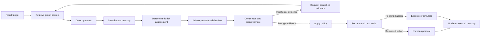

# GraphSentinel

GraphSentinel is an analyst-facing, agentic fraud investigation workspace built for the TigerGraph HHGOA hackathon. It turns each of the 20 benchmark alerts into a defensible case by connecting the IEEE-CIS transactions, identity records, resolved-case memory, policy rules, and governed next actions.

The downloaded HHGOA package in `docs/` is now the app's active data source. A memory-efficient preprocessing pass validates all 590,742 transactions and produces a compact local investigation index. The same UI and agent workflow can switch from that local index to a live TigerGraph RESTPP query when credentials are configured.

## What is implemented

- All 20 HHGOA cases loaded from `case_pack.csv`
- Streaming validation/indexing for the 708 MB transaction file (no dataframe-sized memory requirement)
- Interactive customer/card/transaction/device/region graph with suspicious-link highlighting
- Deterministic evidence synthesis with a complete, explainable tool trace
- Advisory multi-model review with Gemini key rotation, Groq, OpenRouter, Mistral Agent, and optional local Spirit
- LLM evidence explanations and read-only tool selection constrained to a deterministic allowlist
- Known-pattern and undocumented-pattern investigation with resolved-case memory
- Policy-aware initial/final actions with exact `auto`, `L1`, and `L2` routes
- Per-case exposure, chronological episode start, connected cards, and standalone SAR narrative
- Customer challenge, approval, escalation, and immutable audit-log simulation
- Twenty validated JSON submission files in `output/hhgoa/cases/`
- TigerGraph HHGOA schema, GSQL traversal queries, RESTPP adapter, and MCP configuration example
- Reproducible streaming TigerGraph load pipeline and atomic investigation-case writeback
- In-dashboard SAR review and complete HHGOA answer JSON
- Optional production authentication with signed HttpOnly sessions, scrypt hashes, CSRF checks, throttling, and secure headers
- Responsive analyst UI, API-level tests, and submission-contract validation

## Run locally

Requirements: Node.js 20 or newer and Python 3.10 or newer.

The data files should be here:

```text
docs/
  case_pack.csv
  closed_cases_history.csv
  identity.csv
  transactions.csv
  README.md
```

Build and validate the local HHGOA index once after downloading the package:

```bash
npm run data:all
```

This checks the source row/column counts, indexes the investigation neighborhoods, regenerates all 20 case answers, and validates the output contract. The generated index is intentionally ignored by Git because it is derived from the downloaded dataset.

Install and run the app:

```bash
npm install
npm run dev
```

Open `http://localhost:5173`. The API runs on `http://localhost:8787` and Vite proxies `/api` requests during development.

Use the left-hand case queue to select any `HHG-001` through `HHG-020`. The center panel shows the connected evidence graph. **Run investigation** replays the evidence and policy trace, and the recommendation panel shows which actions are automatic and which require human approval.

For a production build:

```bash
npm run build
$env:NODE_ENV="production"
npm start
```

## Multi-model setup

The LLM layer is advisory: it compares independent fraud opinions, explains the evidence, and selects useful read-only tools from a fixed allowlist. It shows the median fraud probability, majority verdict, tool votes, latency, and availability. It never replaces the deterministic HHGOA assessment, changes an approval route, or executes an action.

1. Rotate any credential that has been pasted into chat, source code, a screenshot, or another shared location.
2. Copy `.env.example` to `.env.local`.
3. Put the newly generated credentials in `.env.local`. This file is ignored by Git.
4. Restart `npm run dev`, open a case, and choose **Run agent**.

Supported configuration:

- `GEMINI_API_KEY_1` through `GEMINI_API_KEY_16`: failover pool. One working key is used per investigation; the next key is tried after authentication, quota, timeout, or server failure.
- `GROQ_API_KEY` and optional `GROQ_MODEL`.
- `OPENROUTER_API_KEY` and `SPIRIT_OPENROUTER_MODEL`. A leading `openrouter/` prefix is normalized automatically.
- `MISTRAL_API_KEY`, with `SPIRIT_MISTRAL_AGENT_ID` for the Mistral Conversations API or `SPIRIT_MISTRAL_MODEL` for chat fallback.
- `SPIRIT_AGENT_HOST`, `SPIRIT_AGENT_PORT`, and `SPIRIT_AGENT_MODEL` for an optional local OpenAI-compatible Spirit endpoint. Override its full route with `SPIRIT_AGENT_URL` if needed.

Provider failures are isolated. If one or every model is unavailable, the case still completes with the deterministic baseline and records the degraded provider status in the trace. `GET /api/health` reports only provider names, models, configured state, and the Gemini key count; it never returns credentials.

## Live TigerGraph setup

The loader streams the 708 MB source rather than loading it into a dataframe. It deterministically reconstructs cards, hashes device profiles, writes graph-ready vertices/edges, and includes all 5,565 closed cases.

```bash
npm run graph:prepare
gsql tigergraph/schema.gsql
gsql tigergraph/loading.gsql
npm run graph:load
gsql tigergraph/queries.gsql
```

Then copy `.env.example` to `.env.local`, set the TigerGraph host, graph, token and query, and set `DEMO_MODE=false`. On a live investigation the server runs `fraud_case_context`, then atomically upserts the `InvestigationCase` vertex plus `INVOLVES`, `ON_CARD`, `CONNECTED_TO`, and `SIMILAR_TO` case-memory edges. Failed writeback is never reported as successful.

The server calls:

```text
GET {TIGERGRAPH_HOST}/restpp/query/{TIGERGRAPH_GRAPH}/{TIGERGRAPH_CONTEXT_QUERY}?transaction_id=...
POST {TIGERGRAPH_HOST}/restpp/graph/{TIGERGRAPH_GRAPH}?vertex_must_exist=true
```

`mcp/tigergraph-mcp.example.json` is the companion agent-tool configuration. Replace placeholder values with the same graph connection details before using TigerGraph MCP in an external agent host.

## Decision flow



The included baseline remains deterministic and testable. Model output is used for a second opinion and explanation only, while entity traversal, exposure calculation, policy routes, and human approval boundaries stay explicit.

## Public deployment security

Authentication is disabled only for local development unless `AUTH_REQUIRED=true`. Production mode refuses to start without a secure session secret, an scrypt password hash, a username, and an HTTPS application origin.

Generate credentials locally (the command prints them to your terminal):

```bash
node scripts/generate_auth_secrets.mjs "use-a-strong-unique-password"
```

Store `APP_SESSION_SECRET`, `APP_PASSWORD_HASH`, API keys, and the TigerGraph token in the deployment platform's secret manager—not in Git, client-side code, build arguments, or browser storage. In production, `.env` files are not loaded unless `ALLOW_ENV_FILES=true` is explicitly set. Deploy behind HTTPS and set `APP_ORIGIN` to the exact public HTTPS origin.

Authenticated sessions use signed, expiring, `HttpOnly`, `Secure`, `SameSite=Strict` cookies. Mutating API calls additionally require a session-bound CSRF token and matching origin. Login attempts are throttled, API responses are marked `no-store`, and CSP/HSTS/security headers are applied.

## API

- `GET /api/health` — public service, graph, dataset, and safe LLM configuration status
- `GET /api/auth/session` — current secure session
- `POST /api/auth/login` / `POST /api/auth/logout` — analyst authentication
- `GET /api/cases` — authenticated case queue
- `GET /api/cases/:id` — authenticated full case record and answer JSON
- `POST /api/cases/:id/investigate` — governed agent run and optional graph writeback
- `POST /api/cases/:id/actions` — authenticated, CSRF-protected analyst action

## Tests

```bash
npm test
npm run data:validate
npm run build
```

The normal suite mocks TigerGraph at the HTTP boundary and verifies query encoding, bearer-token placement, atomic writeback payloads, API-level errors, authentication, CSRF, case-memory similarity, policy routing, and the explainable investigation trace. The dataset validator additionally verifies all 20 filenames and required fields, affected transaction existence and order, exposure arithmetic, action/route compatibility, SAR/action agreement, and narrative constraints.

To run the two integration tests against an actual TigerGraph instance, configure TigerGraph, set `DEMO_MODE=false`, `TIGERGRAPH_LIVE_TEST=true`, and a valid `TIGERGRAPH_TEST_TRANSACTION_ID`, then run:

```bash
npm run test:tigergraph:live
```

The live writeback test creates a uniquely named `InvestigationCase` test vertex.

After the live tests pass, generate confirmed submission answers without replacing the local baseline:

```bash
npm run submission:live
npm run submission:validate-live
```

When the 20 live files validate, rerun with `npm run submission:live -- --replace` to place them in the final `output/hhgoa/cases` folder. Create the secret-free archive with `npm run submission:package`. The package also contains the seven-slide pitch deck and three-minute demo script under `submission/`.

## Submission status

`output/hhgoa/cases/` contains a complete, validated deterministic baseline for all 20 cases. These source files deliberately report `written_to_graph: false` while the app uses its local index. During a live investigation the API writes the case to TigerGraph and returns an answer copy with `written_to_graph: true` and the confirmed graph case ID; the source answer is never changed unless TigerGraph accepted the atomic write.
